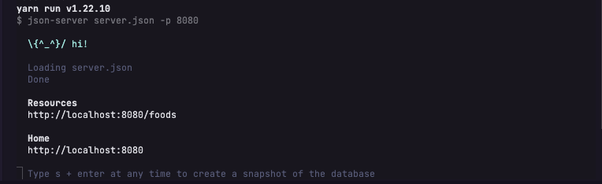
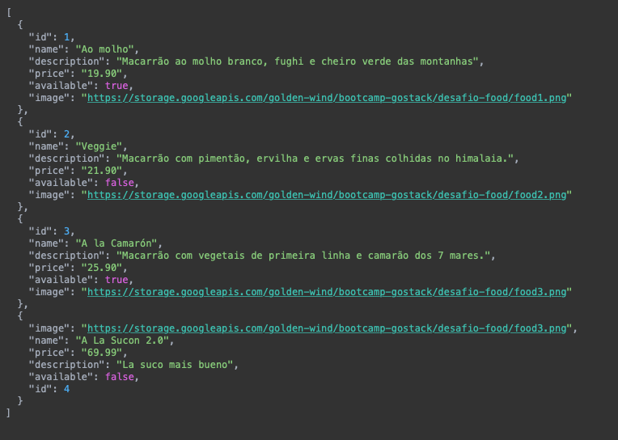

<p align="center">
  
</p>


## Súmario

- [Súmario](#súmario)
- [💻 Sobre o desafio](#-sobre-o-desafio)
- [📌 Template da aplicação](#-template-da-aplicação)
- [Preparando o desafio](#preparando-o-desafio)
- [Fake API com JSON Server](#fake-api-com-json-server)
- [O que deve ser alterado na aplicação?](#o-que-deve-ser-alterado-na-aplicação)
- [Preparando ambiente Typescript](#preparando-ambiente-typescript)
- [Estou com dificuldade na conversão classes -> função](#estou-com-dificuldade-na-conversão-classes---função)
- [Como deve ficar a aplicação ao final?](#como-deve-ficar-a-aplicação-ao-final)
- [Executando a aplicação 🚀](#executando-a-aplicação-)
- [License](#license)
- [📧 Contato](#-contato)

<br />
<br />

## 💻 Sobre o desafio
- Nesse desafio, deverá ser criado uma aplicação para treinar, o que já foi absorvido até o momento, sobre ReactJS.
- Essa será uma aplicação já funcional, onde o principal objetivo, será realizar dois processos de migração:
  - De Javascript para Typescript;
  - De Class Components para Function Components;

<br />
<br />

## 📌 Template da aplicação
 - Para auxiliar no desafio, foi elaborado um modelo, que deverá ser utilizado como template do GitHub
 - Template se encontra disponível em: [Template da aplicação](https://github.com/rocketseat-education/ignite-template-reactjs-refactoring-classes-ts)
    - Dica: Caso não souber utilizar repositórios do GitHub como template, a equipe da Rocketseat, elaborou um guia, que se encontra presente no [FAQ da Rocketseat](https://www.notion.so/FAQ-Desafios-ddd8fcdf2339436a816a0d9e45767664)

<br />
<br />

## Preparando o desafio
- Para esse desafio, além do conhecimento e conceitos vistos em aulas anteriores, será utilizado o JSON server para criar uma Fake API com os dados dos pratos que serão servidos.

## Fake API com JSON Server
- Assim como foi utilizado o MirageJS no módulo 2, para simular uma API com os dados das transações da aplicação dt.money, será utilizado o JSON Server para simular neste desafio, uma API que irá possuir as informações dos pratos que serão servidos.
- Navegar até a pasta criada(repositório)
  - Indico utilizar o [VS Code](https://code.visualstudio.com), para desenvolver, porém, é uma escolha pessoal

- Executar os seguintes comandos no terminal:

  ``` bash
    yarn

    yarn server
  ```

- Em seguida, será possível visualizar a seguinte mensagem: 
  

  - Perceba que foi inicializado uma fake API com o recurso /foods em localhost na porta 8080 a partir das informações do arquivo server.json localizado na raiz do projeto. Acessando essa rota nmo navegador, será possível ver o retorno das informações já em JSON.

  <p align="center">
    
  </p>

  <br />

  - Desta forma, basta consumir essas rotas da API normalmente com o Axios. Caso queira se inteirar mais sobre o [Json Server](https://github.com/typicode/json-server), segue um link para consulta. 

<br />

## O que deve ser alterado na aplicação? 
  - Com o template já clonado, as dependências instaladas e a fake API rodando, os seguintes arquivos, precisarão ser editados:
    - src/components/Food/index.jsx;
    - src/components/Food/styles.js;
    - src/components/Header/index.jsx;
    - src/components/Header/styles.js;
    - src/components/Input/index.jsx;
    - src/components/Input/styles.js;
    - src/components/Modal/index.jsx;
    - src/components/ModalAddFood/index.jsx;
    - src/components/ModalAddFood/styles.js;
    - src/components/ModalEditFood/index.jsx;
    - src/components/ModalEditFood/styles.js;
    - src/pages/Dashboard/index.jsx;
    - src/pages/Dashboard/styles.js;
    - src/routes/index.jsx;
    - src/services/api.js;
    - src/styles/global.js;
    - src/App.js;
    - src/index.js;
  
   ```tex
    ==> Obs.: Todos esses arquivos devem ser migrados de Javascript para Typescript. Além disso, os arquivos que possuírem componentes em classes devem ser migrados para componentes funcionais.
   ```

   <br />

   ## Preparando ambiente Typescript
   - Como esse é um projeto CRA sem Typescript, primeiro é preciso instalar as dependências/tipagens e configurar o TS. Uma sugestão, é criar um novo projeto CRA com Typescript e comparar a estrutura atual com a que você precisa ter. Realizando essa comparação, todo o trabalho ficará mais fácil e será possível ver que: 
     - É preciso instalar o typescript;
     - É preciso criar um arquivo de configuração tsconfig.json. Inclusive, pode ser utilizado a configuração gerada automaticamente no CRA template Typescript para criar o seu arquivo;
     - É preciso criar um arquivo react-app-env.d.ts, com o seguinte conteúdo:
        ```typescript
           /// <reference types="react-scripts" />
        ```
     -É preciso instalar as tipagens das bibliotecas;

   - Configurando esse setup, você será capaz de trabalhar normalmente com o Typescript no seu projeto;
  
   <br />

   ## Estou com dificuldade na conversão classes -> função
   - Caso venha ocorrer ou se deparar com alguma dificuldade durante o processo de migração, dê uma olhada no guia sobre esse assunto: [Componentes no React](https://www.notion.so/Componentes-no-React-6644d41da663405cb29dcaae1693bb9f)
  
   ## Como deve ficar a aplicação ao final?
   - Nesse desafio, você já recebe a aplicação totalmente funcional, então todos os recursos mostrados no vídeo a seguir, já estão implementados no template e devem assim, permanecer funcionando após as alterações solicitadas, serem aplicadas.
     - [Vídeo Resultado final](https://s3-us-west-2.amazonaws.com/secure.notion-static.com/d7d94fcf-b6af-40eb-a215-731ac274e475/Peek_2021-03-10_10-43.mp4)

   ## Executando a aplicação 🚀

   - Efetuar clone repositório => git clone [Chapter02 - Desafio02](https://github.com/BManduca/Chapter02_desafio02_Refactoring_classes_typescript.git)
   - Acessar o diretório [chapter02_desafio01_ignite_reactjs](https://github.com/BManduca/Chapter02_desafio02_Refactoring_classes_typescript) => instalar as dependências executando o comando yarn
   - Dar start no servidor => Comando (sudo) yarn server.
   - Acessar aplicação => localhost:3000 no navegador

   <br />
  
  ## License
  - This project is under the MIT license. See the [LICENSE](LICENSE.md) file  for more details.

  <br />

  ## 📧 Contato

  [](mailto:brunnomanducarfe@gmail.com) [](https://www.linkedin.com/in/brunno-manduca-b97080118/) 
    